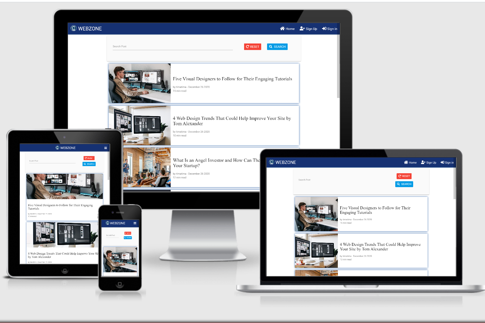

# [WEBZONE](https://webzone-milestone-project-3.herokuapp.com/) - Milestone Project Three

## Table of Content

- [**About**](#About)
- [**UX**](#UX)
    - [User Stories](#User-Stories)
  - [Research](#Research)
  - [Style Rationale](#Style-Rationale)
  - [Wireframes](#Wireframes)
- [**Features**](#Features)
    - [Functionality](#Functionality)
    - [Existing Features](#Existing-Features)
    - [Features Left To Implement](#Features-Left-To-Implement)
- [**Technologies Used**](#Technologies-Used)
    - [Languages Used](#Languages-Used)
    - [Libraries And Frameworks](#Libraries-And-Frameworks)
    - [Tools Used](#Tools-Used)
- [**Testing**](#Testing)
    - [Testing User Stories](#Testing-User-Stories)
    - [Manual Test](#Manual-Test)
    - [HTML, CSS, JavaScript and Python Code Validation](#HTML-CSS-JavaScript-And-Python-Code-Validation)
    - [Mobile Friendly Test](#Mobile-Friendly-Test)
    - [Errors](#Errors)
    - [Resolved Errors](#Resolved-Errors)
    - [Unresolved Errors](#Unresolved-Errors)
- [**Deployment**](#Deployment)
  - [Live App Link](#Live-App-Link)
  - [Repository Link](#Repository-Link)
  - [Running Code Locally](#Running-Code-Locally)
- [**Credits**](#Credits)
    - [Content](#Content)
     - [Media](#Media)
- [**Acknowledgements**](#Acknowledgements)
- [**Disclaimer**](#Disclaimer)

## About

WEBZONE is a blogging application for web development. It is a place where users can read blog posts about web development. Users can also create their own free accounts and create as many posts as they wish about web development.

I created this application to serve the purpose of my Data-Centric Development Milestone Project at Code Institute. The project scope was to create a web app using Python and a no-SQL database (MongoDB), which uses CRUD operations to allow users to easily create, read, update, and delete blog posts.The front-end display and functionality uses HTML, CSS, and JavaScript. The back-end functionality uses Python, Flask, and MongoDB.



## UX

### User Stories

* As a user, I want a blogging site where I can read blog posts about web development.

* As a user, I want to be able to create an account.

* As a user, I want to be able to sign-in and sign-out of my account.

* As a user, I want to be able to create my own posts about web development so that I can inspire others. 

* As a user, I want to be able to edit and update any post I create in case of any mistake or new additional information.

* As a user, I want to be able to search for posts about a particular topic in web development using keywords.

* As a user, I want to be able to delete any post created by me if I choose to do so.

### Research

To understand how to create a blogging app, I  researched tutorials with Python and MongoDB on Youtube and Udemy, and I could get a clear idea of what functionality and design I wanted my web application to have.  User Authentication is not a requirement for Code Institute's Data-Centric Mile Stone Project project but however, I implemented basic user authentication and it was copied from Code Institute's task manager mini-project.

### Style Rationale

I wanted to keep it simple while practicing responsive design.

### Wireframes

The wireframes used in this project were built using Balsamiq Wireframes. These were the first versions but in the development process, there were many changes. This was due to visual preferences and feedback received from my mentor, and also other users who tested my website.

 Some changes can be seen in the fact that my  wireframes have pagination but however, I was not able to implement it on time. I also removed the "view" button and made the post image and contents clickable. And upon clicking, it redirects a user to the view post page where a user can read the post's content. In addition, I added the word "Post" to all post call to action buttons such as "DELETE POST". Futhermore, the search bar on my wireframe does not have any button but on my website I decided to add a "RESET" and a "SEARCH" button.

[Home - signed-in user preview](https://github.com/Takaforyannick30/webzone-milestone-project-three/blob/master/static/wireframes/home_user_in_session.pdf)

[Home - no user signed-in preview](https://github.com/Takaforyannick30/webzone-milestone-project-three/blob/master/static/wireframes/home_no_user.pdf)

[Create post preview](https://github.com/Takaforyannick30/webzone-milestone-project-three/blob/master/static/wireframes/create_post_preview.pdf)

[Delete popup preview](https://github.com/Takaforyannick30/webzone-milestone-project-three/blob/master/static/wireframes/delete_popup_preview.pdf)

[Edit post preview](https://github.com/Takaforyannick30/webzone-milestone-project-three/blob/master/static/wireframes/edit_post_preview.pdf)

[Profile page preview](https://github.com/Takaforyannick30/webzone-milestone-project-three/blob/master/static/wireframes/profile_user.pdf)

[Search - no result found](https://github.com/Takaforyannick30/webzone-milestone-project-three/blob/master/static/wireframes/search_no_result_found.pdf)

[Search - results found](https://github.com/Takaforyannick30/webzone-milestone-project-three/blob/master/static/wireframes/search_results_found.pdf)

[Sign In page preview](https://github.com/Takaforyannick30/webzone-milestone-project-three/blob/master/static/wireframes/sign_in_page_preview.pdf)

[Sign Up page preview](https://github.com/Takaforyannick30/webzone-milestone-project-three/blob/master/static/wireframes/sign_up_page_preview.pdf)

[View post - no signed-in user preview](https://github.com/Takaforyannick30/webzone-milestone-project-three/blob/master/static/wireframes/view_post_no_user.pdf)

[View post - signed-in user preview](https://github.com/Takaforyannick30/webzone-milestone-project-three/blob/master/static/wireframes/view_post_user.pdf)

## Features

### Functionality

The app uses Python logic to allow users to sign-in, or sign-up for a free account. The app offers CRUD operations to allow users to create, read, update, and delete blog posts. In addition, users can search for a blog post using keywords.

### Existing Features

- **Navbar/Sidenav Links** - The navbar and sidenav links vary depending on whether the user is logged in or not. If the user isn't logged in, the Home, Sign Up and Sign In links are shown on the navigation bar. When the user is logged in, the Home, Create Post, Profile, and Sign Out links are shown.

- **Sign Up** - Allows new users to sign-up for a free account. The form's username field and password field only accept letters and or numbers. I've included checks to ensure that the username doesn't already exist in the database before users are successfully registered. The password is been harshed before stored in the database for security purposes.  

- **Sign In** - Allows existing users to sign-in into their account. I've included authorization checks to verify the username and password (hashed password) against the details stored in the database before users can be logged in. If the username and passowrd matches, the user will successfully sign-in.

- **Flash Messages** - The flash messages are been displayed at the top of the page below the navigation bar when the user performs certain actions. These messages differ based on user interaction and provides helper messages for users.

- **Search** - A user can search for a particular post by typing a keyword into the search bar , and the results are subsequently displayed when the user clicks the Search button. For example, if the user searches for 'Python', the results will show all Post with the keyword 'Python' in theit titles. The form field is required, and the user can't submit the form without entering a keyword of minimum 3 characters e.g 'git'. If there is no post in the databse with any keyword provided by the user, upon clicking the search button 'No Result Found' will be displayed on the screen of the user's device.

- **Reset Button** - The reset button is available in the Search bar. Clicking the Reset button refreshes the 'home' page and restores its default values.

- **Create Post** - Create operation. Allows the user to add a new post to the site and database. All input fields must be filled. A user is expected to paste the link of an image they inturn to use as their post image. If the link is not correct then the image will appear broken and there is not default image at the moment.

- **Edit Post** - Update operation. All existing recipe values are pre-populated in the relevant form fields, which the user is able to edit if required. Upon form submission, the recipe database record is updated with the new values. Additionally, the last edited date field in the recipe record is updated with the current date.

- **Delete Post** - The Delete button is only available if a user is logged in and if the post was created by the user. Clicking the button triggers the Delete modal, which asks the user to confirm the deletion request. If the user confirms the deletion, the post will be deleted.

- **Cancel Button (Edit Post Page and Delete Popup Modal)** - There is a 'Cancel' button on the Edit post page and on the Delete Popup Modal. The 'Cancel' button on the edit page redirect the user back to the Home page. And the 'Cancel' button on the Delete modal popup is meant to close the popup.

- **Footer** - My website has a footer section with three subsection and a copyright info. The subsections includes; About Us, Contact Us and Connect With Us. The "Connect With Us" section contains Icons of social platforms such as GitHub, Facebook, Instagram and LinkeLinkedIn. When a user clicks on any of these icons they will be redirected to the website of the social platform.

- **Profile Page** - The profile page displays the owner of the profile.

- **Custom Error Pages** - I've included two custom error pages namely error_404.html - for 'page not found' errors and error_500.html - for 'Internal server errors. 

### Features Left To Implement

- **Rate Post** - In the future I would like to add rating functionality to allow logged-in users to rate any blog post. 

- **Like Post** - In the future I would like to add a 'like' functionality to allow logged-in users to like any blog post. The liked post will be displayed on the user's profile. And all post will show the number of 'like' it has. If it has none it will show 'Be the first to like' when a user hovers on the like icon.

- **Unlike Post** - In the future I would like to add an 'unlike' functionality to allow logged-in users to unlike any blog post they had previously liked. The unliked post will be removed from the user's profile. 

- **Commenting On Post** - I would like to add a feature which allows logged-in users to comment on any post to share their thoughts about the post or reply to other comments.

- **Messaging Other Registered Users** - I would like to add a feature to allow logged-in users to quickly message other registered users.

- **Change Password** - I would like to add a functionality which allows registered users to change their password. A registed user will have to confirm his/her current password in other to change it.

- **Delete Account** - I would like to add a functionality which allows registered users to delete their account. Password confirmation will be required for deleting an account.

- **User's Post** - I would like to add a functionality to view all post created by any user by clicking on the author's name of any blog post.

- **Update Flash Messages** - I would like to update the functionality/logic of the flash messages to display different colors depending on the context of the flash message e.g a flash message such as 'Post Deleted' will have a red background color.

- **Pagination** - I would like to add pagination on the home page and on search results so that only a limited number of post will be displayed at a time. 

## Technologies Used

### languages used

* [HTML](https://en.wikipedia.org/wiki/HTML) 

The use of HTML which stands for Hypertext Markup Language was very paramount to this website as with every website or web-based app. HTML5 was used in this project to keep up with the latest industry standards. 

* [CSS](https://en.wikipedia.org/wiki/Cascading_Style_Sheets)

The use of CSS which stands for Cascading Style Sheet was also very paramount to this project. CSS was used for styling the content on the website.

* [Javascript](https://en.wikipedia.org/wiki/JavaScript)

Javascript, which is mostly been referred to as JS was used in this project mainly through Materialize

* [Python](https://en.wikipedia.org/wiki/Python_(programming_language))

Python is an interpreted, high-level and general-purpose programming language. Python's design philosophy emphasizes code readability with its notable use of significant whitespace. Its language constructs and object-oriented approach aim to help programmers write clear, logical code for small and large-scale projects.

* [Jinja](https://jinja.palletsprojects.com/en/2.11.x/)

Jinja is a modern and designer-friendly templating language for Python. I used Jinja to simplify my HTML code, avoid repetition, and allow simpler linking of the back-end to the front-end.

### Libraries And Frameworks

* [jQuery](https://jquery.com/)

jQuery is a fast, small, and feature-rich JavaScript library. It was used in this project to simplify the DOM.

* [Flask](https://flask.palletsprojects.com/en/1.1.x/)

Flask is a micro web framework written in Python. This project was built using Flask.

* [PyMongo](https://pymongo.readthedocs.io/en/stable/)

PyMongo was used as the Python API for MongoDB. This API enables linking the data from the back-end database to the front-end app.

* [Google Fonts](https://fonts.google.com/)

Google Fonts is a library of 991 free licensed font families, an interactive web directory for browsing the library, and APIs for conveniently using the fonts via CSS and Android. Fugaz One designed by Latino Type and Roboto designed by Christian Robertson, were both used in this project.  

### Tools used

* [Git](https://git-scm.com/)

Git is a free and open source distributed version control system designed to handle everything from small to very large projects with speed and efficiency.Git was used in this project for version control.

* [Gitpod](https://www.gitpod.io/)

Gitpod is an online integrated development environment for GitHub. It creates a complete and disposable development environment for any GitHub repository directly in a browser. This project was developed in Gitpod.

* [GitHub]()

GitHub is a code hosting platform for collaboration and version control. GitHub is the platform where the code for this project has been hosted.

* [Heroku](https://heroku.com/)

Heroku is a cloud platform as a service (PaaS) supporting several programming languages. One of the first cloud platforms, Heroku has been in development since June 2007, when it supported only the Ruby programming language, but now supports Java, Node.js, Scala, Clojure, Python, PHP, and Go. Heroku is the platform where this project has been deployed.

* [Dev Tools](https://developers.google.com/web/tools/chrome-devtools)

Chrome DevTools is a set of web developer tools built directly into the Google Chrome browser. DevTools can help you edit pages on-the-fly and diagnose problems quickly, which ultimately helps you build better websites, faster. Google Chrome's Dev Tools was used in the building process of this project.

* [Balsamiq](https://balsamiq.com/)

Balsamiq Wireframes is a rapid low-fidelity UI wireframing tool that reproduces the experience of sketching on a notepad or whiteboard, but using a computer. Balsamiq wireframes was used in producing the wireframes for this project.

### Database

* [MongoDB](https://www.mongodb.com/) 

MongoDB is a cross-platform document-oriented database program. Classified as a NoSQL database program, MongoDB uses JSON-like documents with optional schemas. MongoDB was used to store the database. The informatio displayed in the front-end app is pulled from the database store.


## Testing

This project has undergone extremely thorough testing. The user story of this project achieved the intended outcome. The manual test was carried out at every stage to ensure user experience standards remained at consistently high levels with each new implementation.

The Webzone application was tested across multiple browsers such as Google Chrome, Safari, Microsoft Edge, Mozilla Firefox, and Opera Mini. It was also tested on multiple mobile devices such as iPhone 4, 5, 7, 8(plus) Chrome and Safari, iPad, Samsung Galaxy, and Huawei P30 Pro to ensure compatibility and responsiveness.

### Testing User Stories

-  **As a user, I want a blogging site where I can read blog posts about web development.** 

1. Click on the "Home" link on the navbar or on the "WEBZONE" logo. They all lead to the home page where blog post are been displayed from the newest at the top to the oldest at the bottom.

-  **As a user, I want to be able to create an account.**

1. Click on the "Sign Up" link on the navbar. 

2. Fill in the Sign Up form with a username and password. The username and password must be between 5 to 15 characters(letters or numbers). 

3. Click on the "Sign Up" button which is on the Sign Up form. Kindly note the Sign Up link on the navigation bar only redirects a user to the Sign Up form. 

4. Flash message will appear saying "Registration Successfull!"

- **As a user, I want to be able to sign-in and sign-out of my account.**

* Sign In 

1. Click on the "Sign In" link in the navbar. 

2. Fill in the Sign In form with your username and password. 

3. Click on the "Sign In" button on the Sign In form. Kindly note the "Sign In" link on the navigation bar only redirects a user to the "Sign In form". 

4. Flash message will appear saying "Welcome, (username)" 

* Sign Out 

1. Click on the "Sign Out" link in the navbar. 

2. A flash message will appear saying "You have been logged out!"

- **As a user, I want to be able to create my own posts about web development so that I can inspire others.** 

1. Click on the "Create Post" link on the navbar. 

2. Fill in the "Create Post" form. All fields are required. 

3. Click on "Create Post" button. 4. Flash message will appear saying "Post Successfully Created!"

- **As a user, I want to be able to edit and update any post I create in case of any mistake or new additional information.**

1. Click on the "EDIT POST" button displayed on the post you want to edit. 

2. Update the Form while taking into consideration that all fieds are required. 

3. Click on the "UPDATE POST" button. 

4. A flash message will appear saying "Post Successfully Updated!"

- **As a user, I want to be able to search for posts about a particular topic in web development using keywords.**

1. Type any keyword in the search bar. 

2. Click on the "Search" button.

- **As a user, I want to be able to delete any post created by me if I choose to do so.**

1. Click on the "DELET POST" button displayed on the post you want to delete. The "DELETE POST" button can be found on the home page or on the view post page. A Modal pop-up will appear when the button is clicked. 

2. Click on the "DELETE POST" button on the pop up to confirm. 

3. A flash message will appear saying "Post deleted!"

### Manual Test

In addition to testing the user stories, I did some additional manual test such as testing that the error handler works as expected. I was able to test the 404 error handler by editing the url of a particular page on my website such as replacing the word "view_post" on the url with "contact". Upon doing this the error_404.html template was been rendered to the browser. I was not able to test the error-500 handler for internal server error because I had no idea how to manually make my website develope an internal server error. But I do believe the error_500.html template will be rendered in such an event.

### HTML, CSS, JavaScript and Python Code Validation

* I used the [W3C HTML Validator tool](https://validator.w3.org/#validate_by_input) to validate my HTML code.
    - The W3C Validator tool doesn't recognise the Jinja templating, which has resulted in it showing a lot of errors in relation to the Jinja code. However, all other code is validating fine.

* I used the [W3C CSS Validator tool](https://jigsaw.w3.org/css-validator/#validate_by_input) to validate my CSS code.

* I used the [Esprima Syntax Validator tool](http://esprima.org/demo/validate.html) to validate my JavaScript syntax. My JavaScript is just few lines cpied from Matiarize.

* I used the [Pep8 Online tool](http://pep8online.com/) to validate my Python syntax.

### Mobile Friendly Test

A mobile friendly test of this website was done using [search.google.com](https://search.google.com/test/mobile-friendly). The responsiveness was also done using websites such as [Am I Responsive](http://ami.responsivedesign.is/) and [Responsinator](http://www.responsinator.com/).

### Errors

### Resolved Errors

* A user could access the Edit post page and could actually delete a post without signing-in. All the user needed to do was to click on a post to view it. Then on the Url, replace the word "view_post" with "edit_post" or "delete_post". To solve this problem I wrote a login required decorator and passed it to some @app.routes. Now if a user who is not signed-in tries to carry out any action which requires a user to sign-in, A flash message will apppear on screen saying `You need to sign in first`

* A user in session could edit and delete post created by others eventhough I added the login_required decorator. To solve this problem I used and "if else" statement to check if the creator of the post is the currently signed-in user. If the result is true the user will be able to edit or delete a post. And if the result is false then the user won't be able to edit or delete the post.

* A user who is not signed-in could also access the Create post page but with the implementaion of the login_required decorator this is no longer possible.


### Unresolved Errors

* There is no default picture for post image. If the post image url is not correct the image will appear broken and the post card will look messy. I acknowlegde that this can lead to poor user experience. I would like to work on this to render a default or plan b image if a user's post image link appears to be broken.

* I tried to implement pagination and it resulted to many errors which I did  not manage to fix on time before submitting this project. I decided to remove the pagination code completely from the app. I acknowlegde that a blogging app like WEBZONE without pagination can result to poor user experience because users have to scroll down to view all post. I am currently learning about pagination and will implement it on all my upcoming projects.

* All post image does not appear to have the same width. It would be good for the user interface if all posts' image on the home page have the same width. I was not able to resolve this error on time.

## Deployment

This project was developed using Gitpod. I used GitHub for my version control and Heroku to host the live version of the project. Heroku hosts complex web applications and services. To deploy my website to Heroku, I used the following steps:

1. Created a requirements.txt file using the following command in the terminal window:

    ```sudo pip3 freeze --local > requirements.txt```

2. Created a Procfile using the following command in the terminal window:

    ```echo web: python <fileName.py> > Procfile```

3. Created the app in Heroku. Once logged in on my dashboard, I clicked `Create a new app` and I named it `webzone-milestone-project-3`. I had to select a region close to me and because am based in Denmark I selected Europe. After that, I then clicked `Create app`

4. Clicked on `Deploy` and on the deployment method, I clicked GitHub. I made sure my GitHub profile was displayed, then I added my repository name. Once it found the repo I clicked to connect to the app.

5. Entered the following Config Vars in Heroku:

```IP : 0.0.0.0```

```PORT : 5000```

```SECRET_KEY : Copied from my env.py file```

```MONGO_URI : <link to MongoDB>```

```MONGO_DBNAME : Entered the name of my Database```

6. Went back to Gitpod, added and committed the files (requirements.txt and Procfile) to Git using the `git add .`, `git commit -m ""` commands in the terminal window. And finally `git push` and the files were pushed to GitHub.

7. Went back to Heroku and could then safely `Enable Automatic Deployment` as everything was available on my repository. I had just one Branch to my app so I clicked `Deploy Branch`. The process took few minutes and after showed "Your app was successfully deployed"  

### Live App Link

Click the link below to run my project in the live environment:

[WEBZONE](http://webzone-milestone-project-3.herokuapp.com/get_posts)

### Repository Link

Click the link below to visit my project's GitHub repository:

[WEBZONE Github repository](https://github.com/Takaforyannick30/webzone-milestone-project-three)

### Running Code Locally

To run my code locally, users can download a local copy of my code to their desktop by completing the following steps:

1. Go to [my GitHub repository](https://github.com/Takaforyannick30/webzone-milestone-project-three)
2. Click on 'Clone or download' under the repository name.
3. Copy the clone URL for the repository in the 'Clone with HTTPs section'.
4. Open 'Git Bash' in your local IDE.
5. Change the current working directory to the location where you want the cloned directory to be made.
6. Type `git clone`, then paste the URL you copied in Step 3:

    ```git clone https://github.com/USERNAME/REPOSITORY```

7. Press `Enter` to complete the process and create your local clone.
8. Create a new Database in MongoDB called *_webzone_blog_* 
9. Create two collections namely *_users_* and *_posts_*. The first collection titled users is where a user's account login details namely; id, username, and hashed password are been stored. And the second collection namely posts is where all information related to a particular post is been stored in the database. The information includes id, post_title, post_image, post_content, read_time, created_by (author) and created_at (time created). 

9. Navigate to the `.bashrc` terminal and add your MongoDB URI in the following format:

    ```MONGO_URI="insert your mongo uri details here"```

10. In the terminal, run the `pip3 install -r requirements.txt` command to install the requirements.txt file.
11. You should now be able to run the app locally using the `python3 run.py` command.

## Credits

### contents

* Most of this project's user authentication functionality was taken from [Code Institute's](https://codeinstitute.net/) task manager mini project. I had to customize it for my app.

* The Modal Structure HTML and JavaScript code was taken from [Materialize Modals](https://materializecss.com/modals.html).

* The Forms Structure was taken from [Materialize Forms](https://materializecss.com/text-inputs.html).

* NavBar HTML and JavaScript code was taken from [Materialize NavBar](https://materializecss.com/navbar.html).

* I read this [Error Handlers Article](https://flask.palletsprojects.com/en/1.0.x/errorhandling/) to learn how to implement error handlers in my Python code.

### Media

* I Created the Logo Icon on my website using [Free logo design](https://www.freelogodesign.org/)

* The favicon on my website was created using [favicon.cc](https://www.favicon.cc/)

## Acknowledgements

* A special thanks to my mentor, Sandeep Aggarwal, for his feedback on my project's scope, design and functionality.

## Disclaimer

This project is for educational purposes only.


[Back to top ↑](#Table-Of-Content)